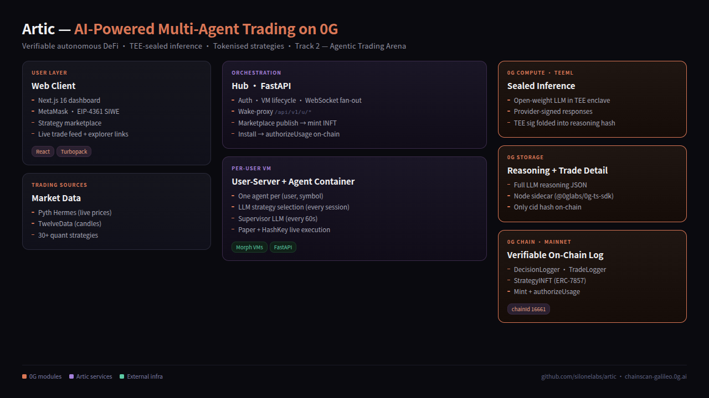

# Artic — Verifiable AI Trading on Injective

> Autonomous AI trading agents where every decision is cryptographically verifiable, every strategy is privately tradable, and every reasoning trace is permanently auditable.



---

## Injective Solo AI Builder Sprint — Submission

**Artic** is submitted to the Injective Solo AI Builder Sprint (deadline May 31 2026).

- **Chain**: Injective inEVM — chainId `2525`
- **RPC**: `https://testnet.rpc.inevm.com/http`
- **Also supports**: 0G Mainnet (chainId `16661`) — set `ACTIVE_CHAIN=0g` to use

---

## 1. Project Overview

**The problem.** Autonomous AI trading is a black box. There is no way to verify what an agent decided, why, or whether execution matched intent. Proprietary strategies leak through public mempools and get front-run.

**Artic.** A multi-agent trading platform where:

1. An LLM selects from **30+ quantitative strategies** and supervises open positions every 60 seconds. Supported providers: OpenAI, Anthropic, DeepSeek, Gemini, and 0G Compute TeeML (hardware-sealed inference).
2. **Every supervisor decision and every trade** is logged immutably on-chain (`DecisionLogger`, `TradeLogger`). Block confirmations make execution publicly auditable.
3. The **full LLM reasoning text** is uploaded to 0G Storage; only the content hash lands on-chain. Auditors can fetch the *why* behind any decision without bloating chain state.
4. **Authentication is EIP-4361 SIWE** — connect an inEVM or 0G wallet, sign a nonce, receive a JWT. No passwords.
5. Per-symbol agent runtimes are isolated inside Morph VMs.

Net result: an LLM-run multi-agent trading platform where every action is publicly verifiable, every reasoning trace is permanently auditable, and the AI reasoning behind every trade is on-chain.

---

## 2. How AI Is Used

The core AI loop runs inside each per-symbol agent:

- **Strategy selection**: on startup the LLM receives current market data + the 30+ strategy descriptors and picks the best fit for the symbol and regime.
- **Supervisor ticks**: every ~60 seconds with an open position, the LLM receives price, candles, current PnL, and active strategy signal. It returns KEEP / CLOSE / ADJUST + a reasoning paragraph.
- **On-chain attestation**: reasoning text is uploaded to 0G Storage; `keccak(storage_cid + tee_sig)` is written to `DecisionLogger` on-chain. When using 0G Compute TeeML, the model response carries a hardware TEE signature that is folded into the on-chain hash.
- **LLM providers** (configurable via `LLM_PROVIDER` env): `openai`, `anthropic`, `deepseek`, `gemini`, `0g_compute`.

---

## 3. Injective Integration

Artic supports **Injective inEVM** (chainId `2525`) for two purposes:

### Wallet auth (EIP-4361 SIWE)

`hub/auth/verifiers/evm_siwe.py` verifies SIWE messages on whichever chain is active. Set `ACTIVE_CHAIN=injective` and the verifier targets inEVM. The web client sends `chain=injective` and MetaMask is prompted to switch to inEVM.

### On-chain audit logging

`DecisionLogger` and `TradeLogger` contracts are deployed to inEVM testnet. Every AI decision and every trade calls these contracts — chain becomes the canonical, tamper-proof audit log.

Set `ACTIVE_CHAIN=injective` and the corresponding `CHAIN_RPC_URL` / contract addresses in `.env.local` (see §5). Deploy fresh contracts with:

```bash
python contracts/deploy.py         # DecisionLogger + TradeLogger
```

### Deployed contracts

**0G Mainnet** (`ACTIVE_CHAIN=0g`):

| Contract | Address |
|---|---|
| DecisionLogger | [`0x70a15Db526104abC2f021b7c690cd89a07EDE49C`](https://chainscan.0g.ai/address/0x70a15Db526104abC2f021b7c690cd89a07EDE49C) |
| TradeLogger | [`0xeeb56334152D6bDB62aacF56f8DbCceA5210b78D`](https://chainscan.0g.ai/address/0xeeb56334152D6bDB62aacF56f8DbCceA5210b78D) |
| StrategyINFT (ERC-7857) | [`0x2A9caFEDFc91d55E00B6d1514E39BeB940832b5D`](https://chainscan.0g.ai/address/0x2A9caFEDFc91d55E00B6d1514E39BeB940832b5D) |

**inEVM Testnet** (`ACTIVE_CHAIN=injective`): deploy with `python contracts/deploy.py` — addresses TBD.

**Verified on-chain activity** (0G Mainnet smoke test):
- DecisionLogged: [`0x2bcbb3a3…a20e`](https://chainscan.0g.ai/tx/0x2bcbb3a3a218f7d96ccb71e596daae3d770c8f33d6f2cbfb3b95e5d0bd44a20e)
- TradeLogged: [`0xe577e9cc…68e0`](https://chainscan.0g.ai/tx/0xe577e9cc5b54ccb1a26a995ced1313d3999fd5f2a8ff506bca6728c838fc68e0)

---

## 4. System Architecture

```
┌──────────────┐    EIP-4361 SIWE (inEVM/0G)   ┌──────────────┐
│  Web Client  │ ──────────────────────────────▶ │     Hub      │
│  (Next.js)   │ ◀── /api/v1/u/* proxy ───────── │  (FastAPI)   │
└──────────────┘                                 └──────┬───────┘
                                                        │ wake / spawn
                                                        ▼
                                                ┌──────────────┐
                                                │ User-Server  │ ── spawns ──┐
                                                │   (per VM)   │             │
                                                └──────────────┘             ▼
                                                                       ┌──────────────┐
                                                                       │    Agent     │
                                                                       │ (one symbol) │
                                                                       └──────┬───────┘
              ┌──────────────────────────────────────┬────────────────┬──────┴──────────┐
              ▼                                      ▼                ▼                 ▼
        ┌───────────┐                       ┌─────────────────┐  ┌───────────┐   ┌─────────────┐
        │ inEVM /   │                       │   0G Compute    │  │ 0G Storage│   │  Exchange   │
        │ 0G Chain  │                       │     TeeML       │  │ reasoning │   │  (paper /   │
        │  Loggers  │                       │  sealed infer   │  │   JSON    │   │  HashKey)   │
        └───────────┘                       └─────────────────┘  └───────────┘   └─────────────┘
```

**Per-tick flow inside an agent:**

1. Fetch live price (Pyth Hermes) + cached candles (TwelveData).
2. Strategy `compute()` produces signal (BUY / SELL / HOLD).
3. Every ~60s with open position: supervisor LLM call → optionally routed to **0G Compute TeeML** → returns KEEP / CLOSE / ADJUST + reasoning text.
4. Reasoning JSON uploaded to **0G Storage** → returns root hash (cid).
5. **`DecisionLogger.logDecision(...)`** emits on-chain event with `reasoningHash = keccak(cid + tee_sig)`.
6. On trade open/close: **`TradeLogger.logTrade(...)`** with detail hash + 0G Storage upload.
7. Hub persists cid alongside trade row; dashboard fetches reasoning on demand via `GET /api/v1/u/hub/trades/{id}/reasoning`.

---

## 5. Repo Layout

```
app/                        # Per-symbol trading engine (FastAPI)
├── engine.py               # Trading loop
├── llm/
│   ├── llm_planner.py      # Strategy selection + supervisor
│   └── og_compute.py       # 0G Compute TeeML client
├── storage/
│   ├── og_storage.py       # 0G Storage client (subprocess to sidecar)
│   └── sidecar/            # Node sidecar (@0glabs/0g-ts-sdk)
├── strategies/             # 30+ quant strategies
├── onchain_logger.py       # DecisionLogger client
└── onchain_trade_logger.py # TradeLogger client

hub/                        # Central orchestrator (FastAPI)
├── auth/verifiers/
│   └── evm_siwe.py         # EIP-4361 verifier (inEVM or 0G, via ACTIVE_CHAIN)
└── onchain/
    ├── inft_client.py      # StrategyINFT mint + authorizeUsage
    └── marketplace_client.py

user-server/                # Per-VM agent runtime + DB push endpoints

contracts/                  # Solidity sources + deploy scripts
├── DecisionLogger.sol
├── TradeLogger.sol
├── StrategyINFT.sol        # ERC-7857
├── deploy.py
├── deploy_trade_logger.py
└── deploy_inft.py

clients/web/                # Next.js dashboard + marketplace
```

---

## 6. Local Setup

### Prerequisites

- Python 3.11+, Node 20+, PostgreSQL 15
- Wallet funded on inEVM testnet (for gas) or 0G Mainnet
- `git`

### Steps

```bash
# 1. Clone
git clone https://github.com/<your-org>/Artic.git && cd Artic

# 2. Python env
python3 -m venv venv && source venv/bin/activate
pip install -r requirements.txt

# 3. Environment
cp .env.example .env
# Edit .env — set DATABASE_URL, JWT_SECRET, INTERNAL_SECRET

# 4. Chain config (.env.local — gitignored)
# For Injective inEVM:
ACTIVE_CHAIN=injective
CHAIN_RPC_URL=https://testnet.rpc.inevm.com/http
CHAIN_PRIVATE_KEY=0x<your-key>
CHAIN_ADDRESS=0x<your-addr>
DECISION_LOGGER_ADDRESS=0x<deploy-first>
TRADE_LOGGER_ADDRESS=0x<deploy-first>
# For 0G Mainnet: ACTIVE_CHAIN=0g, use addresses from §3

# Optional — TeeML sealed inference:
LLM_PROVIDER=0g_compute
ZERO_G_COMPUTE_PROVIDER=0x<provider-addr>

# 5. 0G Storage sidecar
cd app/storage/sidecar && npm install && cd ../../..

# 6. DB migrations
set -a; . ./.env; . ./.env.local; set +a
python -m alembic -c hub/alembic.ini upgrade head

# 7. Run (separate terminals)
# Hub on :9000
python -m uvicorn hub.server:app --host 127.0.0.1 --port 9000

# User-server on :8001
cd user-server && python -m uvicorn user_server.server:app --host 127.0.0.1 --port 8001

# Web client on :3000
cd clients/web && echo 'NEXT_PUBLIC_HUB_URL=http://localhost:9000' > .env.local
bun install && bun dev
```

### End-to-End Demo Flow

1. Open `http://localhost:3000/connect`.
2. **Connect EVM wallet** — MetaMask; switch to inEVM testnet (chainId 2525).
3. **Sign in (SIWE)** — sign the nonce message; JWT returned.
4. Go to `/app` → **Create Agent** for `BTC/USDT`.
5. Watch supervisor LLM tick every 60s; first decision posts on-chain.
6. Click the `tx ↗` link in a decision row → opens the inEVM explorer.
7. Click `reasoning ↗` → fetches full reasoning JSON from 0G Storage.

---

## 7. Demo Video

[Demo video — link TBD]

---

## License

See [LICENSE](LICENSE).
